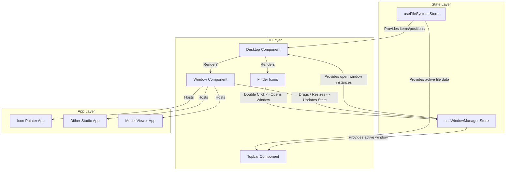

# Architecture

[← Back to README](./README.md)

This document describes the high-level architecture of the project.

## Overall Architecture

The application is a Single Page Application (SPA) driven by React and Zustand. At its core, it attempts to separate the visual presentation of the "Desktop" from the underlying "File System" and "Window Management" states.

1. **State Layer (Zustand Stores):** The ultimate source of truth for what exists on the desktop and what is currently open.
2. **UI Layer (React Components):** The visual representation of the state, interpreting layout constants, scaling, and handling user inputs.
3. **App/Document Layer:** The specific contents rendered inside generic Window containers, some of which interact with 3D contexts (React Three Fiber).

## Major Systems & Relationships

### App Initialization
When the application starts, it initializes the Zustand stores. These stores use persistence middleware to load previous states (like icon positions or open windows) from local storage.

### Desktop UI & Window System
The `Desktop` component acts as the main canvas. It renders icons based on the File System store. When an icon is interacted with (e.g., double-clicked), an action is dispatched to the Window Manager store to open a new `Window`. The `Window` component is a flexible container that frames content, handles drag/resize events, and delegates the actual rendering of the "App" or "Document" to child components.

### Diagram: State & UI Relationship

## 3D Rendering Architecture
For applications like `ModelViewerApp` and `ProjectModelViewer`, the project seamlessly embeds `<Canvas>` elements from `@react-three/fiber` within standard window containers. These instances are isolated contexts, meaning they manage their own 3D scene graphs independently of the main React DOM tree, but they can still read from global Zustand state if necessary.

## Deployment Strategy
The app is built as static files by Vite. It is hosted on platforms like Vercel or GitHub Pages, utilizing SPA fallback configurations to ensure client-side routing (if ever added) or deep links function correctly.
